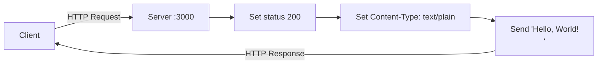
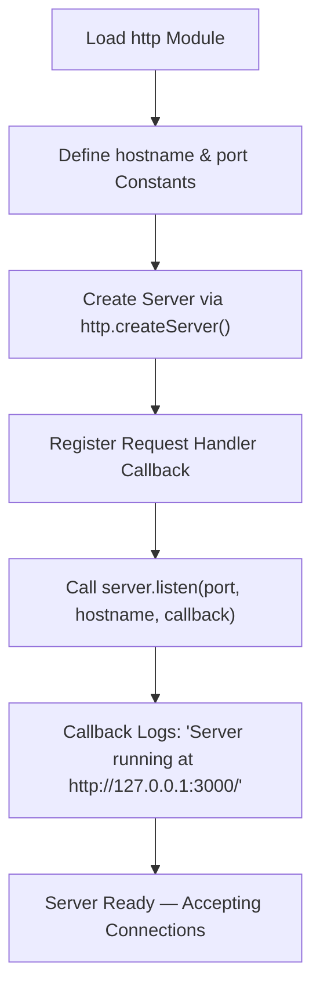

# hao-backprop-test


## About the Project

**hao-backprop-test** is a minimal Node.js HTTP "Hello, World!" server that serves as a **Backprop integration test fixture**. This is a test project for backprop integration — it provides a predictable, stateless HTTP endpoint used to validate Backprop integration behavior.

| Detail       | Value                      |
|--------------|----------------------------|
| Package Name | `hello_world`              |
| Version      | `1.0.0`                    |
| Description  | Hello world in Node.js     |
| Runtime      | Node.js (CommonJS)         |
| Dependencies | **None** (zero npm dependencies) |

The server responds to every incoming HTTP request with a `200 OK` status and the plain-text body `Hello, World!\n`. It binds exclusively to `127.0.0.1` on port `3000`, making it suitable only for local testing.

## Table of Contents

- [About the Project](#about-the-project)
- [Prerequisites](#prerequisites)
- [Getting Started](#getting-started)
- [Usage](#usage)
- [API Documentation](#api-documentation)
- [Code Walkthrough](#code-walkthrough)
- [Deployment Guide](#deployment-guide)
- [Project Structure](#project-structure)
- [Troubleshooting](#troubleshooting)
- [Known Issues](#known-issues)
- [License](#license)
- [Author](#author)

## Prerequisites

- **Node.js v18 or later** — The server uses only the built-in `http` module, so any modern Node.js LTS release (v18+) will work.
- **npm** is bundled with Node.js but is **not required** — this project has **zero npm dependencies**. Running `npm install` will complete successfully but installs nothing.

> **Note:** No additional packages, build tools, or environment variables are needed. The server runs entirely on Node.js built-in modules.

## Getting Started

Follow these steps to clone the repository and start the server:

### 1. Clone the repository

```bash
git clone https://github.com/your-org/hao-backprop-test.git
```

### 2. Navigate into the project directory

```bash
cd hao-backprop-test
```

### 3. Start the server

```bash
node server.js
```

### 4. Verify the server is running

You should see the following output in your terminal:

```
Server running at http://127.0.0.1:3000/
```

The server is now listening for HTTP requests on `http://127.0.0.1:3000/`.

## Usage

Once the server is running, you can send HTTP requests to the endpoint using `curl`, a web browser, or any HTTP client.

### Basic request

```bash
curl http://127.0.0.1:3000/
```

**Expected output:**

```
Hello, World!
```

### Request with full HTTP headers

```bash
curl -i http://127.0.0.1:3000/
```

**Expected output:**

```http
HTTP/1.1 200 OK
Content-Type: text/plain
Date: <current date>
Connection: keep-alive
Keep-Alive: timeout=5
Content-Length: 14

Hello, World!
```

### Stopping the server

Press `Ctrl+C` in the terminal where the server is running to terminate the process.

## API Documentation

The server exposes a single HTTP endpoint that responds identically to all requests regardless of path or method.

### Endpoint Specification

| Property      | Value                                        |
|---------------|----------------------------------------------|
| URL           | `http://127.0.0.1:3000/`                     |
| Method        | Any (route-agnostic, method-agnostic)        |
| Status Code   | `200 OK`                                     |
| Content-Type  | `text/plain`                                 |
| Response Body | `Hello, World!\n`                            |

> **Note:** The server is route-agnostic and method-agnostic — every request to any path (`/`, `/foo`, `/bar/baz`) using any HTTP method (`GET`, `POST`, `PUT`, `DELETE`, etc.) returns the same `200 OK` response with `Hello, World!\n`.

### Example: Full HTTP response

```bash
curl -i http://127.0.0.1:3000/
```

```http
HTTP/1.1 200 OK
Content-Type: text/plain
Date: <current date>
Connection: keep-alive
Keep-Alive: timeout=5
Content-Length: 14

Hello, World!
```

### Request-Response Flow



## Code Walkthrough

This section provides a line-by-line annotated walkthrough of `server.js`. All line number references correspond to the annotated source file (with JSDoc comments included).

### 1. Module Import

```javascript
const http = require('http');
```

Imports the Node.js built-in [`http`](https://nodejs.org/api/http.html) module using CommonJS `require()` syntax. This module provides the `http.createServer()` factory method used to create the server instance. No external packages are imported — `http` is bundled with every Node.js installation.

*Source: `server.js:10`*

### 2. Configuration Constants

```javascript
const hostname = '127.0.0.1';
const port = 3000;
```

Declares two constants that configure the server's network binding:

- **`hostname`** (`'127.0.0.1'`) — The IPv4 loopback address (localhost). The server only accepts connections originating from the local machine. It is not accessible from external networks.
- **`port`** (`3000`) — The TCP port the server listens on. Port 3000 is a conventional development port for Node.js HTTP servers.

*Source: `server.js:18`, `server.js:25`*

### 3. Server Creation with Request Handler

```javascript
const server = http.createServer((req, res) => {
  res.statusCode = 200;
  res.setHeader('Content-Type', 'text/plain');
  res.end('Hello, World!\n');
});
```

Creates an HTTP server instance by calling `http.createServer()` with an anonymous arrow function as the request handler callback. The `server` constant holds the resulting `http.Server` object.

The request handler receives two parameters:

- **`req`** (`http.IncomingMessage`) — The incoming HTTP request object containing method, URL, headers, and body stream. This server ignores `req` entirely — it does not inspect the request method, path, headers, or body.
- **`res`** (`http.ServerResponse`) — The HTTP server response object used to send data back to the client.

The request handler performs three operations on every request:

1. **`res.statusCode = 200`** — Sets the HTTP response status code to `200 OK`.
2. **`res.setHeader('Content-Type', 'text/plain')`** — Sets the `Content-Type` response header to `text/plain`, indicating the response body is plain text.
3. **`res.end('Hello, World!\n')`** — Sends the response body string `Hello, World!\n` and signals that the response is complete.

*Source: `server.js:35-39`*

### 4. Server Startup

```javascript
server.listen(port, hostname, () => {
  console.log(`Server running at http://${hostname}:${port}/`);
});
```

Calls `server.listen()` to bind the server to the configured `hostname` and `port`. The method accepts three arguments:

1. **`port`** (`3000`) — The TCP port to listen on.
2. **`hostname`** (`'127.0.0.1'`) — The network interface to bind to.
3. **Callback function** — An anonymous arrow function executed once the server is successfully bound. It logs the server URL to the console using a template literal.

After this call, the server is actively listening for incoming HTTP connections on `http://127.0.0.1:3000/`.

*Source: `server.js:45-47`*

### Server Lifecycle



## Deployment Guide

This project is an integration test fixture and is **not intended for production deployment**. The following guidance covers local execution for development and testing purposes.

### Local Execution

Start the server directly with Node.js:

```bash
node server.js
```

The server runs in the foreground. To run it in the background:

```bash
node server.js &
```

### Port Requirements

The server listens on **port 3000**. This port must be available (not in use by another process) before starting the server. If port 3000 is occupied, the server will fail with an `EADDRINUSE` error (see [Troubleshooting](#troubleshooting)).

### Localhost Binding

The server binds to `127.0.0.1` (localhost) only. This means:

- ✅ Accessible from the **local machine** at `http://127.0.0.1:3000/`
- ❌ **Not accessible** from other machines on the network
- ❌ **Not accessible** via the machine's external IP address or hostname

This localhost-only binding is intentional for a test fixture and provides basic network isolation.

### Not for Production

This server is a Backprop integration test fixture with the following intentional limitations:

- **No error handling** — Unhandled exceptions will crash the process
- **No HTTPS** — Only plain HTTP is supported
- **No logging** — Only the startup message is logged; requests are not logged
- **No graceful shutdown** — The server does not handle `SIGTERM` or `SIGINT` signals
- **No configuration** — Hostname and port are hardcoded constants
- **No Docker, CI/CD, or cloud deployment** — The project is intentionally minimal

## Project Structure

```
hao-backprop-test/
├── server.js
├── package.json
├── package-lock.json
└── README.md
```

| File               | Purpose                                                             |
|--------------------|---------------------------------------------------------------------|
| `server.js`        | HTTP server entry point — creates and starts the Hello World server |
| `package.json`     | npm package manifest with project metadata                          |
| `package-lock.json`| npm dependency lock file (records zero dependencies)                |
| `README.md`        | Project documentation (this file)                                   |

## Troubleshooting

### `EADDRINUSE` Error

**Symptom:** The server fails to start with an error message containing `EADDRINUSE`.

```
Error: listen EADDRINUSE: address already in use 127.0.0.1:3000
```

**Cause:** Port 3000 is already occupied by another process.

**Solution:** Identify and terminate the process using port 3000:

```bash
# Find the process using port 3000
lsof -i :3000

# Kill the process by PID
kill -9 <PID>
```

Alternatively, stop any other server running on port 3000 and retry `node server.js`.

### No Error Handling

The server does not register an `'error'` event listener on the `http.Server` instance. Any unhandled exceptions (such as a port conflict) will cause the Node.js process to crash with an uncaught exception. This is expected behavior for a test fixture.

### Process Termination

To stop the server, press `Ctrl+C` in the terminal where it is running. If the server was started in the background (e.g., `node server.js &`), use:

```bash
# Bring background process to foreground and terminate
kill %1
```

## Known Issues

### Entry Point Discrepancy

`package.json` declares `"main": "index.js"` but no `index.js` file exists in the repository. The actual entry point is `server.js`.

```json
{
  "main": "index.js"
}
```

This discrepancy does **not** affect running the server directly via `node server.js`. However, it may confuse tools and libraries that resolve a package's entry point by reading the `main` field in `package.json` (e.g., `require('hello_world')` from another module would fail to find `index.js`).

*Source: `package.json:5`*

## License

This project is licensed under the **MIT License** as declared in `package.json`.

*Source: `package.json:10`*

## Author

**hxu**

*Source: `package.json:9`*
