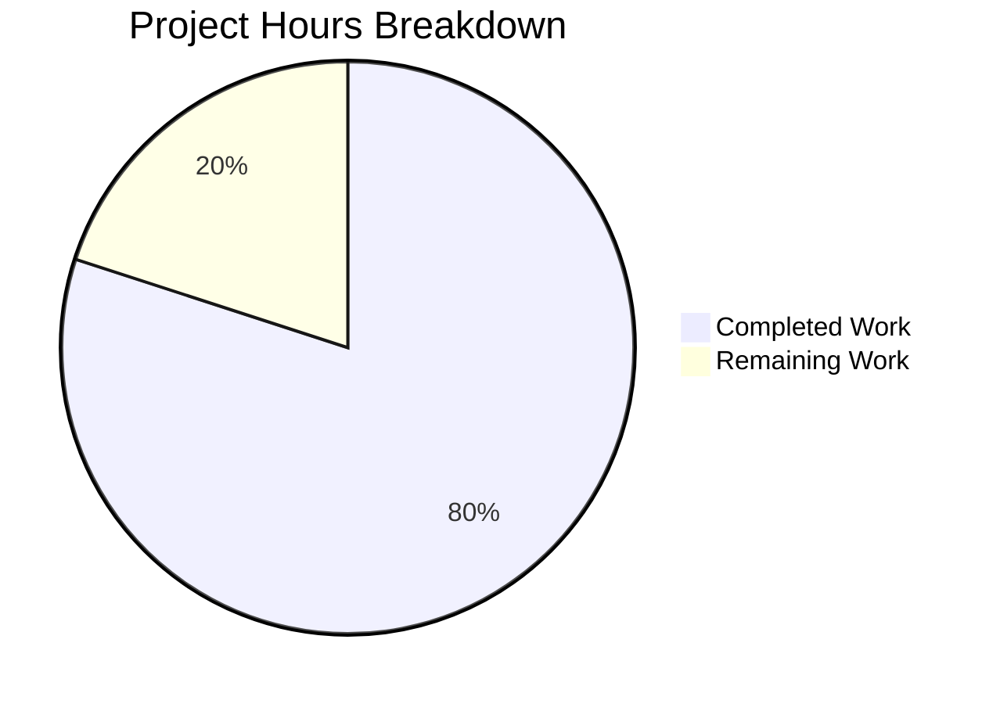

# Project Guide: hao-backprop-test Documentation

## Executive Summary

**Project Completion: 80% (10 hours completed out of 12.5 total estimated hours)**

This documentation project added comprehensive JSDoc inline annotations to `server.js` and replaced the minimal 2-line `README.md` with a 364-line comprehensive project document for the `hao-backprop-test` repository. All five AAP requirements (R-001 through R-005) have been fully implemented and validated. The server starts correctly, responds to HTTP requests as documented, and all JSDoc annotations follow CommonJS conventions with accurate type references.

**Key Achievements:**
- 6/6 documentable constructs in `server.js` annotated with proper JSDoc (100% inline documentation coverage)
- 14-section comprehensive README created with setup instructions, API documentation, deployment guide, code walkthrough, troubleshooting, and 2 Mermaid diagrams
- All `curl` examples verified against running server (HTTP 200 OK, `Hello, World!\n`, 14 bytes)
- Zero compilation errors, zero runtime errors, zero unresolved issues
- All original runtime code in `server.js` preserved byte-identical (documentation-only changes)

**Remaining Human Tasks (2.5 hours):**
- Update README clone URL placeholder (`your-org` → actual GitHub organization)
- Human review and approval of documentation quality
- Optional: Fix `package.json` main field discrepancy

---

## Validation Results Summary

### Final Validator Gate Results

| Gate | Status | Details |
|------|--------|---------|
| GATE 1: Tests | ✅ PASS | No test suite exists — creating tests is explicitly out of scope per AAP §0.8.2 |
| GATE 2: Runtime | ✅ PASS | `node server.js` starts, logs correct URL, responds HTTP 200 with `Hello, World!\n` |
| GATE 3: Zero Errors | ✅ PASS | `node -c server.js` syntax check passes; server runs without errors |
| GATE 4: All Files | ✅ PASS | Both in-scope files (`server.js`, `README.md`) validated and working |

### Files Modified by Agents

| File | Transformation | Lines Before | Lines After | Lines Added | Lines Removed |
|------|---------------|-------------|-------------|-------------|---------------|
| `server.js` | UPDATE (JSDoc only) | 14 | 47 | 33 | 0 |
| `README.md` | UPDATE (rewrite) | 2 | 364 | 363 | 1 |
| **Total** | | **16** | **411** | **396** | **1** |

### Git History

| Commit | Author | Date | Message |
|--------|--------|------|---------|
| `957a11f` | Blitzy Agent | 2026-02-25 | docs: Replace 2-line README stub with comprehensive project documentation |
| `cb00968` | Blitzy Agent | 2026-02-25 | Add JSDoc comment blocks to server.js |

Working tree status: **Clean** (nothing to commit)

### Requirement Completion Matrix

| Requirement | Description | Status | Verification |
|-------------|-------------|--------|-------------|
| R-001 | Add JSDoc comments to `server.js` functions | ✅ Complete | 5 JSDoc blocks, 6/6 constructs annotated |
| R-002 | Create comprehensive README — Setup instructions | ✅ Complete | Prerequisites, Getting Started, Usage sections |
| R-003 | Create comprehensive README — API documentation | ✅ Complete | Endpoint table, curl examples, response details |
| R-004 | Create comprehensive README — Deployment guide | ✅ Complete | Local execution, port requirements, binding constraints |
| R-005 | Create comprehensive README — Inline code explanations | ✅ Complete | Line-by-line Code Walkthrough section |

---

## Hours Breakdown and Completion Calculation

### Completed Hours: 10h

| Component | Hours | Details |
|-----------|-------|---------|
| Documentation analysis & planning | 1.0h | Repository analysis, code construct identification, section planning |
| server.js JSDoc annotations | 2.0h | 5 JSDoc blocks (33 lines), CommonJS conventions, Node.js type references |
| README.md comprehensive rewrite | 5.0h | 14 sections (363 new lines), tables, code examples, Mermaid diagrams |
| Validation & runtime testing | 1.5h | Syntax check, server startup, HTTP response verification, route testing |
| Bug fixes & iteration | 0.5h | Line number alignment, content verification, format corrections |
| **Total Completed** | **10.0h** | |

### Remaining Hours: 2.5h (after 1.21× enterprise multiplier)

| Task | Base Hours | After Multiplier | Priority |
|------|-----------|-------------------|----------|
| Update README clone URL placeholder | 0.5h | 0.5h | High |
| Human review of JSDoc annotations | 0.5h | 0.5h | Medium |
| Human review of README content | 0.5h | 0.5h | Medium |
| Fix package.json main field (optional) | 0.5h | 0.5h | Low |
| Final acceptance testing | — | 0.5h | Medium |
| **Total Remaining** | **2.0h** | **2.5h** | |

### Completion Calculation

```
Completed Hours:  10.0h
Remaining Hours:   2.5h
Total Hours:      12.5h
Completion:       10.0 / 12.5 = 80.0%
```

### Visual Hours Breakdown



---

## Detailed Human Task Table

All remaining tasks for human developers to bring the project to 100% completion. Task hours sum to **2.5 hours** (matching the pie chart "Remaining Work" value).

| # | Task | Description | Action Steps | Hours | Priority | Severity |
|---|------|-------------|-------------|-------|----------|----------|
| 1 | Update README clone URL | README.md line 50 contains placeholder `https://github.com/your-org/hao-backprop-test.git` | 1. Open `README.md` line 50. 2. Replace `your-org` with actual GitHub organization name. 3. Commit the change. | 0.5h | High | Low |
| 2 | Review JSDoc annotations | Verify JSDoc blocks in `server.js` meet team standards | 1. Open `server.js`. 2. Review all 5 JSDoc blocks for accuracy. 3. Verify type annotations (`http.Server`, `http.IncomingMessage`, `http.ServerResponse`). 4. Approve or request changes. | 0.5h | Medium | Low |
| 3 | Review README content | Verify README sections for accuracy and completeness | 1. Read all 14 sections of `README.md`. 2. Verify curl examples match server behavior. 3. Verify Mermaid diagrams render correctly on GitHub. 4. Check line number references in Code Walkthrough. 5. Approve or request changes. | 0.5h | Medium | Low |
| 4 | Fix package.json main field | `package.json` declares `"main": "index.js"` but actual entry point is `server.js` | 1. Open `package.json`. 2. Change `"main": "index.js"` to `"main": "server.js"`. 3. Run `node -c server.js` to verify. 4. Commit the change. (Note: This is documented in Known Issues but was out of AAP scope.) | 0.5h | Low | Low |
| 5 | Final acceptance testing | End-to-end verification after all changes | 1. Run `node server.js`. 2. Execute `curl -i http://127.0.0.1:3000/`. 3. Verify HTTP 200 OK + `Hello, World!\n`. 4. Verify README renders on GitHub. 5. Merge PR. | 0.5h | Medium | Low |
| | **Total Remaining Hours** | | | **2.5h** | | |

---

## Development Guide

### System Prerequisites

| Requirement | Version | Verification Command |
|-------------|---------|---------------------|
| Node.js | v18+ (v20.x LTS recommended) | `node --version` |
| npm | Bundled with Node.js (not required for running) | `npm --version` |
| Git | Any recent version | `git --version` |
| Operating System | Any (Linux, macOS, Windows) | — |

> **Note:** This project has **zero npm dependencies**. No `npm install` step is required.

### Environment Setup

No environment variables, configuration files, or external services are required. The server uses hardcoded constants:
- **Hostname:** `127.0.0.1` (localhost only)
- **Port:** `3000`

### Dependency Installation

```bash
# No dependencies to install — skip this step
# Running npm install will complete but install nothing:
npm install
# Output: "up to date, audited 1 package"
```

### Application Startup

```bash
# Navigate to project root
cd hao-backprop-test

# Start the server
node server.js
```

**Expected console output:**
```
Server running at http://127.0.0.1:3000/
```

The server runs in the foreground. To run in the background: `node server.js &`

### Verification Steps

1. **Verify server is running:**
```bash
curl http://127.0.0.1:3000/
```
Expected output: `Hello, World!`

2. **Verify full HTTP response:**
```bash
curl -i http://127.0.0.1:3000/
```
Expected output:
```http
HTTP/1.1 200 OK
Content-Type: text/plain
Date: <current date>
Connection: keep-alive
Keep-Alive: timeout=5
Content-Length: 14

Hello, World!
```

3. **Verify route-agnostic behavior:**
```bash
curl http://127.0.0.1:3000/any/path/here
```
Expected output: `Hello, World!` (same response for all paths)

4. **Verify syntax (no runtime needed):**
```bash
node -c server.js
# No output = syntax OK
```

### Stopping the Server

```bash
# If running in foreground: press Ctrl+C
# If running in background:
kill %1
```

### Troubleshooting

| Issue | Cause | Solution |
|-------|-------|----------|
| `EADDRINUSE` error | Port 3000 is occupied | Kill the process using port 3000, then retry |
| Server crashes on error | No error handler registered | Expected for test fixture; restart with `node server.js` |
| Cannot connect from another machine | Server binds to `127.0.0.1` only | By design — localhost-only binding for test fixture |

---

## Risk Assessment

### Technical Risks

| Risk | Severity | Likelihood | Impact | Mitigation |
|------|----------|-----------|--------|------------|
| README clone URL contains placeholder (`your-org`) | Low | High | Developers cannot copy-paste the clone command | Update line 50 of README.md with actual GitHub organization (Task #1) |
| `package.json` main field points to nonexistent `index.js` | Low | Medium | Tools using `require()` resolution may fail | Update `"main": "index.js"` to `"main": "server.js"` (Task #4) |
| Line number references in README may drift if `server.js` is modified | Low | Low | Code Walkthrough section becomes inaccurate | Re-verify line references after any future `server.js` changes |

### Security Risks

| Risk | Severity | Likelihood | Impact | Mitigation |
|------|----------|-----------|--------|------------|
| No HTTPS support | Informational | N/A | Not applicable for localhost test fixture | Documented in README Deployment Guide — intentional limitation |
| No input validation | Informational | N/A | Server ignores all request data | By design — stateless test fixture that never reads request body |

### Operational Risks

| Risk | Severity | Likelihood | Impact | Mitigation |
|------|----------|-----------|--------|------------|
| No error handling on server instance | Low | Low | Unhandled errors crash the process | Documented in README Troubleshooting; acceptable for test fixture |
| No graceful shutdown handling | Low | Low | Process termination may not be clean | Documented in README; use Ctrl+C or `kill` |
| No request logging | Informational | N/A | Cannot audit incoming requests | By design — minimal test fixture |

### Integration Risks

| Risk | Severity | Likelihood | Impact | Mitigation |
|------|----------|-----------|--------|------------|
| None identified | — | — | — | Documentation-only changes introduce no integration risks |

**Overall Risk Assessment: LOW** — This is a documentation-only change to a minimal test fixture. No functional code was modified, no dependencies were added, and all runtime behavior is preserved byte-identical.

---

## Project Structure

```
hao-backprop-test/
├── server.js           (47 lines — HTTP server with JSDoc annotations)
├── package.json        (10 lines — npm manifest, zero dependencies)
├── package-lock.json   (13 lines — lockfile confirming zero dependencies)
└── README.md           (364 lines — comprehensive project documentation)
```

**Repository Stats:**
- Total files: 4
- Total lines: 434
- Lines added by agents: 396
- Lines removed by agents: 1
- Net change: +395 lines
- Agent commits: 2
- Languages: JavaScript (CommonJS), Markdown

---

## Summary of Changes

### server.js — JSDoc Annotations Added (No Code Changes)

| JSDoc Block | Tags | Target Construct |
|-------------|------|-----------------|
| File header | `@file`, `@module`, `@author`, `@license`, `@description` | Module-level documentation |
| hostname constant | `@const`, `@type {string}`, `@default`, `@description` | `const hostname = '127.0.0.1'` |
| port constant | `@const`, `@type {number}`, `@default`, `@description` | `const port = 3000` |
| server instance + handler | `@const`, `@type {http.Server}`, `@description`, `@param` ×2 | `const server = http.createServer(...)` |
| server.listen | `@description` | `server.listen(port, hostname, ...)` |

### README.md — Complete Rewrite (2 → 364 lines)

| Section | Lines | Content |
|---------|-------|---------|
| Title & Badges | 1-5 | Project heading with Node.js, MIT, version badges |
| About the Project | 7-22 | Project description, metadata table, purpose |
| Table of Contents | 24-35 | Linked navigation to all sections |
| Prerequisites | 37-41 | Node.js v18+, zero dependencies noted |
| Getting Started | 43-75 | Clone, navigate, start, verify steps |
| Usage | 77-109 | curl examples, expected output, stopping server |
| API Documentation | 111-152 | Endpoint spec table, full HTTP response, Mermaid diagram |
| Code Walkthrough | 154-240 | Line-by-line annotated explanation with source citations |
| Deployment Guide | 242-281 | Local execution, port, binding, production caveats |
| Project Structure | 283-298 | File tree and purpose table |
| Troubleshooting | 300-336 | EADDRINUSE, error handling, process termination |
| Known Issues | 338-352 | Entry point discrepancy documented |
| License | 354-358 | MIT license reference |
| Author | 360-364 | Attribution to hxu |
