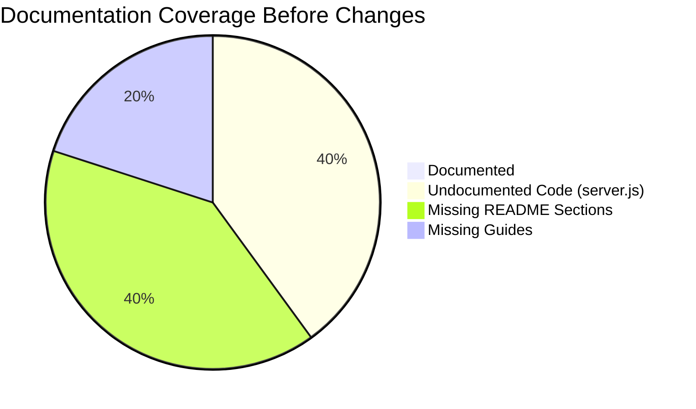

# Technical Specification

# 0. Agent Action Plan

## 0.1 Intent Clarification


### 0.1.1 Core Documentation Objective

Based on the provided requirements, the Blitzy platform understands that the documentation objective is to **create new documentation and improve existing documentation** for the `hao-backprop-test` repository — a minimal Node.js HTTP "Hello, World!" server that serves as a Backprop integration test fixture. The task encompasses two complementary documentation streams:

- **Inline Code Documentation (JSDoc):** Add structured JSDoc comments to all documentable elements in `server.js`, including module-level annotations, constant declarations, the HTTP request handler callback, and the server lifecycle callback. This transforms the source code into self-documenting code that IDEs can parse for type hints, hover tooltips, and auto-completion support.
- **Project-Level Documentation (README.md):** Replace the current minimal two-line `README.md` with a comprehensive project document that provides setup instructions, API documentation, a deployment guide, and inline code explanations — making the repository accessible to developers who encounter it for the first time.

**Documentation Category:** Create new documentation | Update existing documentation
**Documentation Type:** API docs, README file, Deployment guide, Inline code comments (JSDoc)

**Requirement Breakdown:**

| # | Requirement | Clarification |
|---|-------------|---------------|
| R-001 | Add JSDoc comments to `server.js` functions | Annotate every documentable construct in `server.js` using JSDoc syntax: `@file`, `@module`, `@const`, `@param`, `@callback`, `@type`, and `@description` tags for the module, constants (`hostname`, `port`), the `http.createServer` request handler callback, the `server` instance, and the `server.listen` startup callback |
| R-002 | Create comprehensive README — Setup instructions | Document prerequisites (Node.js runtime), cloning the repository, and how to start the server via `node server.js` |
| R-003 | Create comprehensive README — API documentation | Document the single HTTP endpoint at `http://127.0.0.1:3000/`, including the request method (any), response status (`200 OK`), response header (`Content-Type: text/plain`), and response body (`Hello, World!\n`) |
| R-004 | Create comprehensive README — Deployment guide | Document how to run the server in local and non-production environments, including port requirements and localhost binding considerations |
| R-005 | Create comprehensive README — Inline code explanations | Provide a line-by-line walkthrough of `server.js` explaining the purpose and behavior of each code segment |

### 0.1.2 Special Instructions and Constraints

- No specific style guide or template was provided by the user — documentation will follow standard JSDoc conventions for CommonJS Node.js modules and standard Markdown conventions for `README.md`
- The existing `README.md` contains only two lines: a heading (`# hao-backprop-test`) and a directive (`test project for backprop integration. Do not touch!`). The comprehensive README will preserve the project identity while expanding coverage
- The project uses CommonJS module syntax (`require('http')`) — JSDoc comments must follow CommonJS conventions as documented at `jsdoc.app/howto-commonjs-modules`
- No user-provided templates or examples were specified
- No Figma designs or design system are relevant to this documentation task

### 0.1.3 Technical Interpretation

These documentation requirements translate to the following technical documentation strategy:

- To **document server.js functions** (R-001), we will **update** `server.js` by inserting JSDoc comment blocks above each documentable element: a `@file` / `@module` block at the top of the file, `@const` blocks for `hostname` and `port`, a `@callback` or inline description for the anonymous request handler passed to `http.createServer()`, a `@const` block for the `server` variable, and a description for the `server.listen` callback
- To **create setup instructions** (R-002), we will **create** a new comprehensive `README.md` with a "Getting Started" section that covers Node.js prerequisites, repository cloning, dependency installation (or lack thereof), and the `node server.js` startup command
- To **create API documentation** (R-003), we will **create** an "API Reference" section within `README.md` documenting the single HTTP endpoint's request/response contract with a table of HTTP details and `curl` examples
- To **create a deployment guide** (R-004), we will **create** a "Deployment" section within `README.md` covering local execution, environment requirements, port configuration caveats, and known limitations (localhost-only binding)
- To **create inline code explanations** (R-005), we will **create** a "Code Walkthrough" section within `README.md` providing annotated line-by-line explanations of the `server.js` source code

### 0.1.4 Inferred Documentation Needs

Based on code analysis and repository structure:

- **Module-level JSDoc is absent:** `server.js` contains zero documentation comments. Every construct — from the `require('http')` import to the `server.listen()` call — lacks any JSDoc annotation. This is the primary inline documentation gap.
- **Entry point discrepancy needs documentation:** `package.json` declares `"main": "index.js"` but no `index.js` file exists; the actual entry point is `server.js`. The README should clarify this discrepancy to prevent developer confusion.
- **Zero-dependency nature should be highlighted:** The project intentionally has no `dependencies` or `devDependencies`. Documentation should explicitly call out that `npm install` is not required (or produces no effect).
- **Project purpose context is critical:** The README should explain the repository's role as a Backprop integration test fixture, preserving the original intent while making the project approachable.
- **Troubleshooting section inferred:** Common issues such as port 3000 being occupied (`EADDRINUSE`) and the absence of error handling in `server.js` should be documented in a troubleshooting section.
- **License information:** The MIT license declared in `package.json` should be referenced in the README.


## 0.2 Documentation Discovery and Analysis


### 0.2.1 Existing Documentation Infrastructure Assessment

Repository analysis reveals a **minimal documentation infrastructure** with **near-zero documentation coverage**. The project contains exactly four files at the repository root with no subdirectories, no documentation generators, and no documentation configuration files.

**Search patterns employed:**
- Documentation files matching `README*`, `docs/**`, `*.md`, `*.mdx`, `*.rst`, `wiki/**` — Found: `README.md` only
- Documentation generator configs (`mkdocs.yml`, `docusaurus.config.js`, `sphinx.conf.py`, `.jsdoc.json`, `jsdoc.json`, `jsdoc.conf.json`) — Found: **None**
- Existing JSDoc annotations in source code — Found: **None** (zero `/** */` blocks in `server.js`)
- Style guides or contribution docs (`CONTRIBUTING.md`, `STYLEGUIDE.md`, `CODE_OF_CONDUCT.md`) — Found: **None**
- Changelog files (`CHANGELOG.md`, `HISTORY.md`) — Found: **None**

**Infrastructure findings:**

| Component | Status | Details |
|-----------|--------|---------|
| Documentation framework | **None** | No mkdocs, Docusaurus, Sphinx, or any static doc generator detected |
| Documentation generator config | **None** | No `.jsdoc.json`, `jsdoc.json`, or `jsdoc.conf.json` found |
| API documentation tools | **None** | No JSDoc, TypeDoc, or Swagger/OpenAPI tooling installed |
| Diagram tools | **None** | No Mermaid CLI, PlantUML, or diagram generation tools configured |
| Documentation hosting/deployment | **None** | No GitHub Pages, ReadTheDocs, or Netlify configuration |
| Existing README.md | **Minimal** | Two lines: project heading and immutability warning |
| Inline source documentation | **None** | `server.js` contains zero JSDoc comment blocks |

### 0.2.2 Repository Code Analysis for Documentation

**Search patterns used for code to document:**
- Public APIs / exported functions: `server.js` — No formal exports via `module.exports`; the file creates a server as a side effect
- Module interfaces: No `index.js` (despite `package.json` declaring `"main": "index.js"`), no `src/` directory
- Configuration options: No `config/` directory, no `.env` files — all configuration is hardcoded as constants in `server.js`
- CLI commands: None — server is started via `node server.js`

**Key directories examined:**
- Repository root (`/`) — Flat structure with 4 files: `server.js`, `package.json`, `package-lock.json`, `README.md`
- No subdirectories exist — no `src/`, `lib/`, `docs/`, `test/`, or `examples/` folders

**Documentable constructs identified in `server.js`:**

| Line(s) | Construct | Type | Current Docs | JSDoc Needed |
|---------|-----------|------|-------------|--------------|
| 1 | `const http = require('http')` | Module import | None | `@module` and `@file` block |
| 3 | `const hostname = '127.0.0.1'` | Constant declaration | None | `@const {string}` |
| 4 | `const port = 3000` | Constant declaration | None | `@const {number}` |
| 6-10 | `(req, res) => { ... }` | Request handler callback | None | `@callback` with `@param` for `req`, `res` |
| 6 | `const server = http.createServer(...)` | Server instance | None | `@const {http.Server}` |
| 12-14 | `() => { console.log(...) }` | Listen callback | None | Inline description |

**Related documentation found:** None — there are no existing docs that provide context or require updates beyond the two-line `README.md`.

### 0.2.3 Web Search Research Conducted

- **JSDoc best practices for Node.js CommonJS modules:** JSDoc's official documentation at `jsdoc.app` provides guidance for CommonJS modules, recommending the use of `@module` tags with `require()`-based identifiers. The `@callback`, `@param`, `@const`, and `@type` tags are the primary annotations needed for this codebase.
- **JSDoc version:** The latest stable version is **4.0.5** (published on npm). It supports Node.js 12.0.0 and later, making it fully compatible with the project's Node.js v20.20.0 runtime.
- **README structure conventions for Node.js projects:** Standard sections include: project title, description, prerequisites, installation, usage, API reference, deployment, contributing, and license. The comprehensive README will follow this established convention.
- **Documentation generation approach:** JSDoc can generate HTML documentation from annotated source code using `npx jsdoc server.js --destination docs/`. A `jsdoc.json` configuration file can customize this behavior. However, since the project has zero dependencies, JSDoc would need to be added as a `devDependency` if HTML generation is desired.


## 0.3 Documentation Scope Analysis


### 0.3.1 Code-to-Documentation Mapping

**Module requiring documentation:**

- **Module: `server.js`**
  - Public APIs / Documentable Constructs:
    - `hostname` — String constant holding the server bind address (`'127.0.0.1'`)
    - `port` — Number constant holding the server listen port (`3000`)
    - Request handler callback — Anonymous arrow function `(req, res) => { ... }` passed to `http.createServer()`
    - `server` — HTTP server instance created by `http.createServer()`
    - Listen callback — Anonymous arrow function `() => { ... }` passed to `server.listen()`
  - Current documentation: **Missing** — zero JSDoc comment blocks exist in the file
  - Documentation needed: File-level `@file`/`@module` annotation, `@const` for each constant, `@callback` with `@param` for the request handler, `@const` with `@type` for the server instance, inline description for the listen callback

**Configuration options requiring documentation:**

| Config Element | File | Location | Currently Documented | Documentation Needed |
|----------------|------|----------|---------------------|---------------------|
| `hostname` | `server.js` | Line 3 | No | JSDoc `@const` + README explanation |
| `port` | `server.js` | Line 4 | No | JSDoc `@const` + README explanation |
| `name` | `package.json` | Line 2 | No | README project identity section |
| `version` | `package.json` | Line 3 | No | README project identity section |
| `main` (discrepancy) | `package.json` | Line 5 | No | README known issues section |
| `author` | `package.json` | Line 9 | No | README attribution section |
| `license` | `package.json` | Line 10 | No | README license section |

**Features requiring user guides:**

| Feature | Current Coverage | Gaps |
|---------|-----------------|------|
| Server startup | None | Setup prerequisites, start command, expected console output |
| HTTP endpoint | None | Request/response contract, curl examples, supported methods |
| Deployment | None | Local execution guide, port requirements, binding constraints |
| Code understanding | None | Line-by-line walkthrough, architecture explanation |
| Troubleshooting | None | Common errors (EADDRINUSE), no error handling caveats |

### 0.3.2 Documentation Gap Analysis

Given the requirements and repository analysis, documentation gaps include:

**Undocumented code elements (100% gap):**
- `server.js` — Zero JSDoc comments on any of the 6 documentable constructs (file module, 2 constants, request handler callback, server instance, listen callback)

**Missing project-level documentation:**
- No setup/installation instructions anywhere in the repository
- No API reference describing the HTTP endpoint contract
- No deployment or operations guide
- No code walkthrough or architecture explanation
- No troubleshooting guide for common issues
- No license section in README (MIT license is declared only in `package.json`)
- No contribution guidelines (appropriate given the "Do not touch!" directive)

**Outdated or incomplete documentation:**
- `README.md` currently contains only a project heading and an immutability warning — it does not describe what the project does, how to run it, or how the code works




## 0.4 Documentation Implementation Design


### 0.4.1 Documentation Structure Planning

The documentation deliverables are organized into two tiers: inline source documentation (JSDoc in `server.js`) and project-level documentation (comprehensive `README.md`). Since this is a single-file, zero-dependency project, a flat documentation structure within the README is appropriate rather than a multi-file `docs/` hierarchy.

**Target documentation structure:**

```
hao-backprop-test/
├── README.md                (comprehensive project documentation)
│   ├── Project Title & Description
│   ├── Table of Contents
│   ├── About the Project
│   ├── Prerequisites
│   ├── Getting Started / Setup Instructions
│   ├── Usage
│   ├── API Documentation
│   ├── Code Walkthrough (Inline Code Explanations)
│   ├── Deployment Guide
│   ├── Project Structure
│   ├── Troubleshooting
│   ├── Known Issues
│   ├── License
│   └── Author
├── server.js                (with JSDoc annotations added)
│   ├── @file / @module block
│   ├── @const hostname
│   ├── @const port
│   ├── @callback requestHandler
│   ├── @const server
│   └── server.listen inline docs
├── package.json             (unchanged)
└── package-lock.json        (unchanged)
```

### 0.4.2 Content Generation Strategy

**Information Extraction Approach:**
- Extract server configuration details from `server.js` lines 1-4 (module import, hostname, port constants)
- Extract HTTP response behavior from `server.js` lines 6-10 (request handler: status 200, Content-Type, body)
- Extract server lifecycle from `server.js` lines 12-14 (listen binding and startup log)
- Extract project metadata from `package.json` (name, version, author, license, description)
- Generate `curl` examples by documenting the known HTTP endpoint behavior

**JSDoc Annotation Strategy:**
- Use `@file` tag for the file-level description at the top of `server.js`
- Use `@module` tag to identify the CommonJS module
- Use `@const` with `@type` for `hostname` (string) and `port` (number)
- Use `@type` with `{http.Server}` for the `server` variable
- Document the anonymous request handler inline using a descriptive comment block with `@param {http.IncomingMessage}` and `@param {http.ServerResponse}`
- Document the listen callback with an inline description

**Documentation Standards:**
- Markdown formatting with proper headers (`#`, `##`, `###`) in README
- Code examples using triple-backtick fenced blocks with `javascript`, `bash`, or `http` language identifiers
- Tables for parameter descriptions, response details, and project structure
- Consistent terminology: "server," "request handler," "endpoint," "callback"
- Source citations as inline references: `Source: server.js:Line N`

### 0.4.3 Diagram and Visual Strategy

**Mermaid diagrams to include in README.md:**

- **Request-Response Flow Diagram:** A simple flowchart showing the HTTP request-response cycle: Client → Server (port 3000) → Response (200, Hello World)
- **Server Lifecycle Diagram:** A sequence or state diagram showing: Module Load → Config → Create Server → Listen → Ready

These diagrams will be embedded directly in the README using Mermaid fenced code blocks, which render natively on GitHub.

### 0.4.4 JSDoc Comment Design

The following JSDoc comment structure will be applied to `server.js`:

**File-level block** (top of file, before `require`):
```javascript
/**
 * @file HTTP Hello World server
 * @module server
 */
```

**Constant annotations** (before each `const`):
```javascript
/** @const {string} hostname */
/** @const {number} port */
```

**Request handler** (before `http.createServer`):
```javascript
/**
 * @param {http.IncomingMessage} req
 * @param {http.ServerResponse} res
 */
```


## 0.5 Documentation File Transformation Mapping


### 0.5.1 File-by-File Documentation Plan

The following table maps every documentation file to be created or updated, with the target file listed first.

| Target Documentation File | Transformation | Source Code/Docs | Content/Changes |
|---------------------------|----------------|------------------|-----------------|
| `README.md` | **UPDATE** | `README.md`, `server.js`, `package.json` | Complete rewrite: replace 2-line stub with comprehensive documentation including project description, table of contents, prerequisites, setup instructions, usage guide, API documentation with curl examples, inline code walkthrough of server.js, deployment guide, project structure table, troubleshooting section, known issues, license, and author attribution |
| `server.js` | **UPDATE** | `server.js` | Add JSDoc comment blocks: `@file`/`@module` header, `@const {string}` for `hostname`, `@const {number}` for `port`, `@param {http.IncomingMessage}`/`@param {http.ServerResponse}` for request handler callback, `@type {http.Server}` for `server` instance, inline description for `server.listen` callback |

### 0.5.2 Documentation File: README.md — Update Detail

**File:** `README.md`
**Transformation:** UPDATE (complete rewrite of existing 2-line file)
**Source Files:** `server.js` (runtime behavior), `package.json` (project metadata), `package-lock.json` (dependency confirmation)

**Sections to create:**

| Section | Content Source | Description |
|---------|---------------|-------------|
| Project Title & Badges | `package.json` (name, version, license) | Project heading with Node.js and license badges |
| About the Project | `README.md` (original context), `package.json` (description) | Expanded project description covering purpose as Hello World server and Backprop test fixture |
| Table of Contents | Generated from sections | Linked table of contents for navigation |
| Prerequisites | `package.json` (engines, runtime) | Node.js v18+ requirement, no additional dependencies |
| Getting Started / Setup | `package.json`, `server.js` | Clone, verify Node.js, run `node server.js`, verify startup message |
| Usage | `server.js` lines 6-10, 12-14 | How to start server, expected console output, curl example |
| API Documentation | `server.js` lines 6-10 | Endpoint table: URL, methods, status code, headers, response body |
| Code Walkthrough | `server.js` lines 1-14 | Line-by-line annotated explanation of every code construct |
| Deployment Guide | `server.js` lines 3-4, 12-14 | Local execution, port binding, localhost-only constraint, no production deployment |
| Project Structure | Repository root listing | Table of all 4 files with purpose descriptions |
| Troubleshooting | `server.js` (behavioral analysis) | EADDRINUSE errors, no error handling, process termination |
| Known Issues | `package.json` line 5 | Entry point discrepancy (`main: index.js` vs actual `server.js`) |
| License | `package.json` line 10 | MIT license reference |
| Author | `package.json` line 9 | Attribution to `hxu` |

**Diagrams to embed:**
- Request-response flow (Mermaid flowchart)
- Server lifecycle (Mermaid sequence diagram)

### 0.5.3 Documentation File: server.js — Update Detail

**File:** `server.js`
**Transformation:** UPDATE (add JSDoc comments; no functional code changes)
**Source:** `server.js` (current 14 lines without documentation)

**JSDoc blocks to add:**

| Location | JSDoc Tag(s) | Purpose |
|----------|-------------|---------|
| Before line 1 (top of file) | `@file`, `@module`, `@author`, `@license` | File-level module documentation identifying purpose, author, and license |
| Before line 3 (`hostname`) | `@const`, `@type {string}`, `@default` | Document the server hostname constant with its fixed value |
| Before line 4 (`port`) | `@const`, `@type {number}`, `@default` | Document the server port constant with its fixed value |
| Before line 6 (`server = http.createServer(...)`) | `@const`, `@type {http.Server}`, description | Document the HTTP server instance and its request handler |
| Inline at line 6 (request handler) | `@param {http.IncomingMessage}`, `@param {http.ServerResponse}` | Document the request handler callback parameters |
| Before line 12 (`server.listen(...)`) | Inline comment | Document the server startup and binding behavior |

**Estimated line count after changes:** ~40 lines (14 original code lines + ~26 lines of JSDoc comments)

### 0.5.4 Documentation Configuration Updates

No documentation configuration files currently exist. The following may optionally be created to support JSDoc HTML generation:

| Config File | Status | Purpose |
|------------|--------|---------|
| `jsdoc.json` | Not required (optional) | JSDoc configuration for HTML documentation generation — only needed if `jsdoc` devDependency is added |
| `mkdocs.yml` | Not applicable | No static site generator is in use |
| `.readthedocs.yml` | Not applicable | No ReadTheDocs hosting configured |

Since the user's requirements focus on inline JSDoc comments and a README (not HTML documentation generation), no configuration files are required.

### 0.5.5 Cross-Documentation Dependencies

- **README.md ↔ server.js:** The README's "Code Walkthrough" section will reference specific line numbers in `server.js`. If JSDoc comments shift line numbers, the walkthrough must reference the post-JSDoc line positions.
- **README.md ↔ package.json:** The README will extract project metadata (name, version, author, license) from `package.json`. No changes to `package.json` are planned.
- **Navigation:** The README's Table of Contents will use Markdown anchor links to section headings within the same file.
- **No cross-file documentation links** are needed since all documentation resides in two files (`README.md` and `server.js`).


## 0.6 Dependency Inventory


### 0.6.1 Documentation Dependencies

The project currently has zero dependencies. The following documentation tools are relevant to this documentation exercise but are **not required to be installed** since the user's requirements specify inline JSDoc comments (which require no tooling) and a Markdown README (which requires no generator).

| Registry | Package Name | Version | Purpose | Required? |
|----------|-------------|---------|---------|-----------|
| npm | jsdoc | 4.0.5 | JSDoc HTML documentation generator — can generate HTML API docs from annotated `server.js` | **No** — JSDoc comments work without the tool installed; only needed for HTML generation |
| Built-in | Node.js `http` | (bundled with Node.js v20.20.0) | The sole runtime dependency used by `server.js` — documented as part of API reference | N/A — already built-in |

**Key observation:** The user's requirement is to "add JSDoc comments to server.js functions" — this means inserting `/** */` comment blocks directly into the source file. JSDoc comments are a code convention, not a runtime dependency. The `jsdoc` npm package is only required if the team later wants to generate HTML documentation from those comments.

If the team elects to add JSDoc HTML generation in the future, the following `devDependency` addition to `package.json` would be needed:

```json
"devDependencies": {
  "jsdoc": "^4.0.5"
}
```

### 0.6.2 Runtime and Environment Dependencies

| Component | Version | Source | Purpose |
|-----------|---------|--------|---------|
| Node.js | v20.20.0 (LTS) | Verified via `node --version` | JavaScript runtime required to execute `server.js` |
| npm | v11.1.0 | Verified via `npm --version` | Package manager (used for project identity only; no dependencies to install) |

### 0.6.3 Documentation Reference Updates

Since the project currently has no inter-document links (the existing README contains no links), no link transformation rules are required. The new comprehensive README will establish the initial link structure:

- Internal anchor links: Table of Contents → Section headings within README.md
- No external documentation links need updating
- No cross-repository documentation references exist


## 0.7 Coverage and Quality Targets


### 0.7.1 Documentation Coverage Metrics

**Current coverage analysis:**

| Coverage Dimension | Documented | Total | Coverage |
|--------------------|-----------|-------|----------|
| JSDoc-annotated constructs in `server.js` | 0 | 6 | **0%** |
| README sections (setup, API, deployment, walkthrough) | 0 | 4 (user-required) | **0%** |
| Configuration options documented | 0 | 2 (hostname, port) | **0%** |
| Project metadata in README (name, version, author, license) | 0 | 4 | **0%** |

**Target coverage after implementation:**

| Coverage Dimension | Target | Details |
|--------------------|--------|---------|
| JSDoc-annotated constructs in `server.js` | **100%** (6/6) | All documentable elements annotated: file module, hostname, port, request handler, server instance, listen callback |
| README sections covering user requirements | **100%** (4/4) | Setup instructions, API documentation, deployment guide, inline code explanations |
| Configuration options documented | **100%** (2/2) | Both `hostname` and `port` documented in JSDoc and README |
| Project metadata in README | **100%** (4/4) | Name, version, author, and license all included |

**Coverage gaps to address:**

| Element | Current | Target | Action |
|---------|---------|--------|--------|
| `server.js` JSDoc comments | 0% | 100% | Add 6 JSDoc comment blocks covering all constructs |
| README setup instructions | 0% | 100% | Create complete Getting Started section |
| README API documentation | 0% | 100% | Create API Reference section with endpoint table and curl examples |
| README deployment guide | 0% | 100% | Create Deployment Guide section |
| README code walkthrough | 0% | 100% | Create Code Walkthrough section with line-by-line annotations |
| README troubleshooting | 0% (inferred) | 100% | Create Troubleshooting section for common issues |

### 0.7.2 Documentation Quality Criteria

**Completeness requirements:**
- All JSDoc blocks include `@description`, type annotations (`@type`, `@const`), and parameter documentation (`@param`) where applicable
- README setup instructions cover the complete path from zero to running server (prerequisites → clone → start → verify)
- API documentation includes all HTTP details: URL, method(s), status code, headers, body, and at least one working `curl` example
- Deployment guide covers local execution and explicitly notes localhost-only constraint
- Code walkthrough explains every logical section of `server.js`

**Accuracy validation:**
- JSDoc type annotations must match actual runtime types (e.g., `hostname` is `string`, `port` is `number`, `server` is `http.Server`)
- `curl` examples in README must produce the documented response when executed against a running server
- Line references in code walkthrough must correspond to actual line numbers in the post-JSDoc `server.js`
- All project metadata (name, version, license) must match values in `package.json`

**Clarity standards:**
- Technical accuracy with accessible language suitable for developers encountering the project for the first time
- Progressive disclosure: project overview first, then setup, then detailed API and code walkthrough
- Consistent terminology: use "server" (not "application" or "app"), "request handler" (not "listener" or "middleware"), "endpoint" (not "route" or "URL")

**Maintainability:**
- Source citations in README reference `server.js` line numbers and `package.json` fields
- JSDoc comments are minimal and declarative — they describe what the code does, not implementation details that could drift from the code

### 0.7.3 Example and Diagram Requirements

| Requirement | Target | Details |
|-------------|--------|---------|
| curl examples in API docs | 1 minimum | `curl http://127.0.0.1:3000/` with expected output |
| Mermaid diagrams in README | 2 | Request-response flow diagram, server lifecycle diagram |
| Code snippets in walkthrough | 4-5 segments | Each logical section of `server.js` presented with explanation |
| Startup command examples | 1 minimum | `node server.js` with expected console output |


## 0.8 Scope Boundaries


### 0.8.1 Exhaustively In Scope

**Source code documentation updates:**
- `server.js` — Add JSDoc comment blocks to all documentable constructs (file-level module annotation, constant declarations, request handler callback, server instance, listen callback)

**Project-level documentation updates:**
- `README.md` — Complete rewrite with the following sections:
  - Project title, description, and badges
  - Table of contents
  - About the project (purpose and context)
  - Prerequisites (Node.js requirement)
  - Getting started / setup instructions
  - Usage (starting the server, expected output)
  - API documentation (endpoint specification, curl examples)
  - Code walkthrough (inline code explanations)
  - Deployment guide (local execution, constraints)
  - Project structure (file inventory table)
  - Troubleshooting (common errors)
  - Known issues (entry point discrepancy)
  - License (MIT)
  - Author attribution

**Documentation assets:**
- Mermaid diagrams embedded in `README.md` (request-response flow, server lifecycle)

### 0.8.2 Explicitly Out of Scope

- **Functional code modifications to `server.js`:** No changes to runtime behavior — only JSDoc comment additions. The `require`, constants, request handler logic, and `server.listen` call remain untouched.
- **`package.json` modifications:** No changes to the package manifest. The entry point discrepancy (`main: index.js`) will be documented in the README but not corrected in `package.json`.
- **`package-lock.json` modifications:** No changes to the lock file.
- **Adding new dependencies:** The `jsdoc` npm package will not be added as a dependency unless the user explicitly requests HTML documentation generation. The scope is limited to inline JSDoc comments.
- **Creating a `docs/` directory or multi-file documentation:** All documentation fits within `README.md` and inline `server.js` comments given the project's minimal size.
- **Test file modifications or additions:** No test infrastructure exists and none will be created.
- **CI/CD, Docker, or deployment infrastructure:** No deployment configuration will be created or modified.
- **Feature additions or code refactoring:** The server's behavior remains identical — only documentation is added.
- **JSDoc HTML generation setup:** No `.jsdoc.json` config file, no `jsdoc` devDependency addition, and no documentation build scripts unless explicitly requested.
- **Documentation for files other than `server.js` and `README.md`:** `package.json` and `package-lock.json` are not targets for documentation changes.


## 0.9 Execution Parameters


### 0.9.1 Documentation-Specific Instructions

| Parameter | Value | Notes |
|-----------|-------|-------|
| Documentation build command | N/A | No documentation generator configured; README is plain Markdown |
| Documentation preview command | Open `README.md` in any Markdown viewer or push to GitHub for rendered preview | GitHub natively renders Mermaid diagrams in Markdown |
| Diagram generation command | N/A | Mermaid diagrams are embedded directly in Markdown; GitHub renders them natively |
| Documentation deployment command | N/A | No documentation hosting configured |
| Default format | Markdown (`.md`) with Mermaid diagram blocks | Standard GitHub-compatible Markdown |
| Citation requirement | All README sections reference source file and line numbers | e.g., `Source: server.js:6-10` |
| Style guide | Standard JSDoc conventions for CommonJS modules; standard Markdown for README | No project-specific style guide exists |
| Documentation validation | Manual review; verify JSDoc syntax with `npx jsdoc server.js --explain` (if jsdoc is installed) | Alternatively, VS Code with JSDoc support can validate inline |

### 0.9.2 Server Verification Command

To verify the documentation accuracy (API reference section), the server can be started and tested:

```bash
node server.js &
curl -i http://127.0.0.1:3000/
kill %1
```

Expected output from `curl -i`:
```http
HTTP/1.1 200 OK
Content-Type: text/plain
...
Hello, World!
```

### 0.9.3 JSDoc Validation Approach

JSDoc comments in `server.js` can be validated by:
- **IDE validation:** Opening `server.js` in VS Code — hover tooltips should display JSDoc descriptions and type annotations for each construct
- **Syntax check (if jsdoc package is installed):** `npx jsdoc server.js --explain` outputs a JSON representation of parsed doclets, confirming all annotations are correctly recognized
- **Manual review:** Verify each JSDoc block has correct tag usage (`@file`, `@module`, `@const`, `@type`, `@param`, `@description`) and that type annotations match runtime types


## 0.10 Rules for Documentation


The following rules govern the documentation implementation for this project:

- **No functional code changes:** JSDoc comments are the only modifications permitted in `server.js`. All existing runtime code (lines 1-14) must remain byte-identical. No logic, constants, imports, or control flow may be altered.
- **JSDoc must follow CommonJS conventions:** Since `server.js` uses `require('http')` (CommonJS), JSDoc annotations must use `@module` with the module identifier pattern, and `@type` references must use Node.js built-in type names (e.g., `http.Server`, `http.IncomingMessage`, `http.ServerResponse`).
- **README must be self-contained:** All documentation must reside within the single `README.md` file. No external documentation files or directories should be created, as the project is a 4-file minimal fixture.
- **Preserve project context:** The README must convey that this repository is a Backprop integration test fixture. The original context from the existing README ("test project for backprop integration") must be preserved within the expanded documentation.
- **Include working examples:** Every `curl` command and code snippet in the README must produce the exact output documented when run against the actual server.
- **Use Mermaid diagrams for visual documentation:** Architecture and flow diagrams must use Mermaid syntax within fenced code blocks (triple-backtick `mermaid` blocks) for native GitHub rendering.
- **Maintain source citations:** Technical claims in the README must reference specific source files and line numbers to enable traceability (e.g., `Source: server.js:3`).
- **Document the entry point discrepancy:** The README must explicitly note that `package.json` declares `"main": "index.js"` but the actual entry point is `server.js`, to prevent developer confusion.
- **Keep documentation synchronized with code:** JSDoc comments and README content must reflect the actual state of `server.js` after documentation changes are applied. Line number references in the README must account for the JSDoc comment insertions.


## 0.11 References


### 0.11.1 Repository Files and Folders Searched

The following files and folders were exhaustively searched and analyzed to derive the conclusions in this Agent Action Plan:

| File/Folder | Path | Purpose in Analysis |
|-------------|------|-------------------|
| Repository root | `/` (flat, 4 files) | Verified complete file inventory — no subdirectories, no `docs/`, `src/`, `test/`, or `examples/` folders exist |
| `server.js` | `/server.js` | Primary source file analyzed for JSDoc annotation targets — 14 lines, 6 documentable constructs identified, zero existing documentation |
| `package.json` | `/package.json` | Project metadata extraction: name (`hello_world`), version (`1.0.0`), description, author (`hxu`), license (`MIT`), entry point discrepancy (`main: index.js`) |
| `package-lock.json` | `/package-lock.json` | Confirmed zero dependencies (lockfileVersion 3, root-only package entry) |
| `README.md` | `/README.md` | Assessed existing documentation: 2 lines only — project heading and immutability directive |

### 0.11.2 Technical Specification Sections Referenced

| Section | Key Information Extracted |
|---------|-------------------------|
| §1.1 Executive Summary | Project purpose as Backprop integration test fixture; stakeholder identification; value proposition |
| §1.2 System Overview | Component inventory (4 files); core technical approach table; entry point discrepancy documentation; success criteria |
| §2.1 Feature Catalog | Three features cataloged: F-001 (HTTP Response Serving), F-002 (Localhost Network Binding), F-003 (Backprop Test Fixture) |
| §3.1 Programming Languages | JavaScript (CommonJS) as sole language; Node.js v20.20.0 LTS; npm v11.1.0; no TypeScript |
| §4.3 HTTP Request-Response Handling | Complete request processing flow; zero decision points; route-agnostic, method-agnostic, stateless handler |
| §5.2 Component Details | Detailed analysis of all 4 files; server lifecycle sequence diagram; state transition model |
| §6.1 Core Services Architecture | Confirmed single-process monolithic architecture; no services decomposition; architectural invariants |

### 0.11.3 External Research Sources

| Source | URL | Information Used |
|--------|-----|-----------------|
| JSDoc Official Documentation | `https://jsdoc.app/` | CommonJS module documentation conventions; tag reference (`@file`, `@module`, `@const`, `@param`, `@type`, `@callback`) |
| JSDoc npm Package | `https://www.npmjs.com/package/jsdoc` | Latest stable version confirmed: 4.0.5; Node.js compatibility (12.0.0+) |
| JSDoc CommonJS Modules Guide | `https://jsdoc.app/howto-commonjs-modules` | Best practices for documenting `require()`-based modules with `@module` and `@alias` tags |

### 0.11.4 Attachments

No attachments were provided for this project. No Figma designs, templates, or supplementary files were included.


