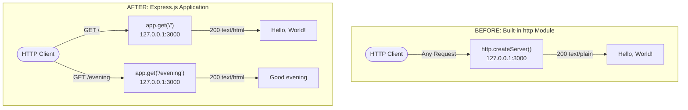

# Technical Specification

# 0. Agent Action Plan

## 0.1 Intent Clarification

### 0.1.1 Core Feature Objective

Based on the prompt, the Blitzy platform understands that the new feature requirement is to:

- **Integrate Express.js into the existing Node.js project** — The current `server.js` uses the Node.js built-in `http` module to create a bare HTTP server. The user requests replacing this low-level HTTP handling with the Express.js web framework, introducing structured routing, middleware support, and a more maintainable server architecture.

- **Preserve the existing "Hello World" endpoint** — The current server responds to all incoming HTTP requests with `"Hello, World!\n"` (status `200`, `Content-Type: text/plain`). With Express.js routing, this behavior must be retained and bound to a specific route (the root path `GET /`).

- **Add a new endpoint returning "Good evening"** — A second route must be created that responds with the text `"Good evening"` when accessed. This will be implemented as a distinct `GET` route (e.g., `GET /evening`) within the Express.js application.

Implicit requirements detected:

- Express.js must be added as a `dependency` in `package.json` and its lockfile `package-lock.json` must be regenerated to include Express.js and all its transitive dependencies.
- The server's existing binding to `127.0.0.1:3000` must be preserved to maintain the same network behavior.
- The CommonJS module system (`require()`) used by the project must be maintained for consistency with the existing codebase conventions.
- The `main` field in `package.json` currently points to `index.js` (a file that does not exist); this discrepancy should be corrected to point to `server.js` as part of this integration effort.

### 0.1.2 Special Instructions and Constraints

- **No specific version constraint provided** — The user did not specify an Express.js version. The latest stable version (`5.2.1`) available on npm will be used, which is compatible with the project's Node.js v20.20.0 runtime.
- **Maintain backward compatibility** — The existing `"Hello, World!\n"` response must remain accessible after the migration. The integration must not remove or alter this behavior.
- **No architectural overhaul** — The user's request is a targeted addition. The project should remain a single-file server (`server.js`) without introducing unnecessary structural complexity such as separate router files, middleware layers, or configuration systems.
- **No test framework specified** — The current project has no test infrastructure (`package.json` test script echoes an error). No test additions are expected unless implied by standard feature addition practices.

### 0.1.3 Technical Interpretation

These feature requirements translate to the following technical implementation strategy:

- To **integrate Express.js**, we will install the `express` npm package (version `5.2.1`) as a production dependency and refactor `server.js` to replace the `http.createServer()` call with an Express application instance (`const app = express()`).
- To **preserve the Hello World response**, we will define an Express route handler `app.get('/', ...)` that sends the `"Hello, World!\n"` response with the same `200` status and `text/plain` content type.
- To **add the Good Evening endpoint**, we will create a new Express route handler `app.get('/evening', ...)` that responds with the text `"Good evening"`.
- To **maintain server binding**, we will replace `server.listen()` with `app.listen(port, hostname, callback)` using the same `127.0.0.1` hostname and `3000` port constants.
- To **update project metadata**, we will modify `package.json` to add `express` to the `dependencies` field and correct the `main` field from `index.js` to `server.js`.
- To **update the lockfile**, the `package-lock.json` will be regenerated via `npm install` to include Express.js and all its transitive dependencies.

## 0.2 Repository Scope Discovery

### 0.2.1 Comprehensive File Analysis

The repository has a flat structure consisting of exactly four files with zero subdirectories. Every file in the repository is relevant to this feature addition:

| File | Type | Current Purpose | Impact Level | Action Required |
|------|------|----------------|--------------|-----------------|
| `server.js` | Runtime source | Sole entry point; creates HTTP server using built-in `http` module, binds to `127.0.0.1:3000`, responds with `"Hello, World!\n"` | **Critical** | MODIFY — Refactor to use Express.js; add new `/evening` route |
| `package.json` | NPM manifest | Declares project identity (`hello_world`, v1.0.0), author (`hxu`), MIT license; zero dependencies; `main` points to non-existent `index.js` | **Critical** | MODIFY — Add `express` dependency; correct `main` field to `server.js`; add `start` script |
| `package-lock.json` | Dependency lock | lockfileVersion 3; confirms zero dependencies; root-only entry | **Critical** | MODIFY — Regenerated automatically by `npm install express` with full Express dependency tree |
| `README.md` | Documentation | Two lines: project name and backprop integration warning | **Low** | MODIFY — Update to reflect Express.js integration and new endpoint documentation |

**Integration point discovery:**

- **API endpoints** — The current server has no route differentiation (all requests receive the same response). Express.js introduces structured routing, requiring endpoint definitions for `GET /` and `GET /evening`.
- **Server initialization** — The `http.createServer()` call in `server.js` (line 6) is the sole integration point where Express replaces the built-in HTTP module.
- **Network binding** — The `server.listen()` call in `server.js` (line 12) will be replaced by `app.listen()` with identical host and port parameters.
- **No database, middleware, service layer, or controller files exist** — The integration surface is confined entirely to `server.js`.

### 0.2.2 Web Search Research Conducted

The following research was performed to inform the implementation:

- **Express.js latest stable version** — Confirmed via npm registry lookup that Express.js `5.2.1` is the current latest version. Express 5 was officially released as stable, and version 5.1.0 became the default on npm. Express 5 requires Node.js >= 18, which is satisfied by the project's Node.js v20.20.0 runtime.
- **Express 5 compatibility with CommonJS** — Express 5 continues to support CommonJS `require()` imports, maintaining compatibility with the project's existing module system.
- **Express 5 key changes** — Express 5 dropped support for Node.js versions before v18, updated path-to-regexp for security (ReDoS mitigation), and added native async/await middleware support with automatic rejected promise handling.

### 0.2.3 New File Requirements

No new source files need to be created for this feature addition. The existing `server.js` file will be modified in place to incorporate Express.js. The rationale for this decision is:

- The project is deliberately minimal (a single-file server), and the user's request does not warrant introducing a multi-file architecture.
- Two simple route handlers (`GET /` and `GET /evening`) do not justify separate router or controller files.
- The project's purpose as a tutorial/test fixture benefits from consolidated, readable code in a single file.

**Files modified (complete list):**

| File | Modification Type | Specific Changes |
|------|-------------------|-----------------|
| `server.js` | Refactor | Replace `http` module with Express.js; define `GET /` and `GET /evening` routes; update `listen()` call |
| `package.json` | Update | Add `express` to `dependencies`; correct `main` to `server.js`; add `start` script |
| `package-lock.json` | Regenerate | Automatically updated by npm to include Express.js dependency tree |
| `README.md` | Update | Document Express.js integration, available endpoints, and usage instructions |

## 0.3 Dependency Inventory

### 0.3.1 Private and Public Packages

The following table catalogs all packages relevant to this feature addition:

| Package Registry | Package Name | Version | Type | Purpose |
|-----------------|--------------|---------|------|---------|
| npm (public) | `express` | `5.2.1` | New production dependency | Web framework providing routing, middleware pipeline, request/response abstractions, and HTTP server utilities |
| Node.js built-in | `http` | Bundled with Node.js v20.20.0 | Existing built-in (to be removed) | Currently used for raw HTTP server creation; will be replaced entirely by Express.js |

**Version verification:**

- Express.js `5.2.1` was verified as the latest stable version via `npm view express version`, which returned `5.2.1` from the live npm registry.
- Express 5.x requires Node.js >= 18. The project runs on Node.js v20.20.0, which satisfies this constraint.
- No other new packages are required. Express.js bundles its own HTTP handling (built on top of Node.js `http` module internally) and does not require additional middleware packages for this simple use case.

**Transitive dependencies note:** Installing `express@5.2.1` will introduce transitive dependencies (such as `body-parser`, `cookie`, `debug`, `finalhandler`, `path-to-regexp`, `qs`, `send`, `serve-static`, among others) that are managed automatically by npm and recorded in `package-lock.json`. No direct interaction with these transitive packages is needed for this feature.

### 0.3.2 Dependency Updates

**Import Updates:**

The sole file requiring import changes is `server.js`:

| File | Current Import | Updated Import | Reason |
|------|---------------|----------------|--------|
| `server.js` | `const http = require('http');` | `const express = require('express');` | Replace built-in HTTP module with Express.js framework |

**External Reference Updates:**

| File | Update Type | Specific Change |
|------|-------------|----------------|
| `package.json` | Add dependency | Add `"express": "^5.2.1"` to new `dependencies` field |
| `package.json` | Fix metadata | Change `"main": "index.js"` to `"main": "server.js"` |
| `package.json` | Add script | Add `"start": "node server.js"` to `scripts` field |
| `package-lock.json` | Full regeneration | Regenerated by npm to include Express.js and all transitive dependencies |
| `README.md` | Documentation update | Add Express.js usage notes and endpoint documentation |

## 0.4 Integration Analysis

### 0.4.1 Existing Code Touchpoints

The integration surface for this feature is tightly scoped to a single runtime file (`server.js`) and its supporting metadata files. The following analysis maps every code location that must change:

**Direct modifications required in `server.js`:**

| Location | Current Code | Modification | Rationale |
|----------|-------------|--------------|-----------|
| Line 1 | `const http = require('http');` | Replace with `const express = require('express');` and `const app = express();` | Swap raw HTTP module for Express.js application factory |
| Lines 3–4 | `const hostname = '127.0.0.1';` / `const port = 3000;` | Retain as-is | Preserve existing network binding constants |
| Lines 6–10 | `http.createServer((req, res) => { ... })` | Replace with `app.get('/', (req, res) => { res.send('Hello, World!\n'); });` | Convert catch-all handler to Express route for `GET /` |
| — (new) | — | Add `app.get('/evening', (req, res) => { res.send('Good evening'); });` | New route handler for the `GET /evening` endpoint |
| Lines 12–14 | `server.listen(port, hostname, () => { ... })` | Replace with `app.listen(port, hostname, () => { ... })` | Use Express's built-in listen method with same host/port |

**Direct modifications required in `package.json`:**

| Field | Current Value | New Value | Rationale |
|-------|--------------|-----------|-----------|
| `main` | `"index.js"` | `"server.js"` | Correct entry point discrepancy — `index.js` never existed |
| `dependencies` | (absent) | `{ "express": "^5.2.1" }` | Declare Express.js as a production dependency |
| `scripts.start` | (absent) | `"node server.js"` | Add convenience start script for running the server |

**Dependency injection and service registration:**

- Not applicable — the project has no dependency injection container, service registry, or IoC framework. Express.js is consumed directly via `require('express')`.

**Database and schema updates:**

- Not applicable — the project has no database, ORM, migrations, or persistent storage of any kind.

### 0.4.2 Architectural Impact

The following diagram illustrates the before-and-after architecture transformation:



**Key behavioral changes:**

- **Route differentiation** — The current server is route-agnostic (all paths return the same response). After integration, requests are dispatched to specific route handlers based on HTTP method and path.
- **Default response for unmatched routes** — Express.js returns a `404` status with a default HTML error page for requests that do not match any defined route, unlike the current server which returns `"Hello, World!\n"` for every request.
- **Content-Type behavior** — Express's `res.send()` automatically sets `Content-Type` based on the response body type. For string responses, Express sets `text/html` by default rather than `text/plain`. If exact `text/plain` content type preservation is required for the Hello World endpoint, `res.type('text').send(...)` can be used.

## 0.5 Technical Implementation

### 0.5.1 File-by-File Execution Plan

Every file listed below must be modified as part of this feature addition. No new files are created; all changes apply to existing files in the flat repository structure.

**Group 1 — Core Runtime (Critical Path):**

- **MODIFY: `server.js`** — Refactor the sole runtime entry point to replace Node.js built-in `http` module with Express.js application. Define two route handlers: `GET /` returning `"Hello, World!\n"` and `GET /evening` returning `"Good evening"`. Retain the existing `hostname` and `port` constants and use `app.listen()` for network binding.

**Group 2 — Project Metadata and Dependencies:**

- **MODIFY: `package.json`** — Add `express` version `^5.2.1` to a new `dependencies` field. Correct the `main` field from `"index.js"` to `"server.js"`. Add a `"start": "node server.js"` entry under `scripts` for convenience.
- **MODIFY: `package-lock.json`** — Regenerated automatically when `npm install express` is executed. Will expand from a root-only entry to include the full Express.js dependency tree.

**Group 3 — Documentation:**

- **MODIFY: `README.md`** — Update to document the Express.js integration, list available endpoints (`GET /` and `GET /evening`), and provide instructions for installing dependencies and starting the server.

### 0.5.2 Implementation Approach per File

**`server.js` — Express.js Migration and New Endpoint**

The implementation replaces the entire HTTP handling mechanism. The refactored file will follow this structure:

```javascript
const express = require('express');
const app = express();
```

The `hostname` and `port` constants remain unchanged. Two route handlers are defined using Express's declarative routing API, followed by `app.listen()` with the same callback logging pattern. The key transformation is from a single anonymous request handler attached to `http.createServer()` to discrete, path-based route definitions.

**`package.json` — Dependency Declaration and Metadata Correction**

The `dependencies` field is added with Express.js pinned to the `^5.2.1` semver range, allowing compatible patch and minor updates. The `main` field correction resolves a pre-existing discrepancy documented in the tech spec where `index.js` was declared but never existed. The `start` script provides a standard `npm start` entry point.

**`package-lock.json` — Dependency Tree Expansion**

This file will be regenerated by npm to include Express.js and all its transitive dependencies. The lockfile version remains `3` (compatible with npm v7+). The regeneration is automatic and deterministic — no manual edits are required.

**`README.md` — Documentation Refresh**

The README will be expanded to include:

- Project description reflecting Express.js usage
- Installation instructions (`npm install`)
- Server startup command (`npm start` or `node server.js`)
- Endpoint documentation table listing `GET /` and `GET /evening` with their responses

## 0.6 Scope Boundaries

### 0.6.1 Exhaustively In Scope

The following constitutes the complete and exhaustive list of files and components within scope for this feature addition:

**Source files:**

| File Pattern | Specific File(s) | Scope Detail |
|-------------|-------------------|--------------|
| `server.js` | `server.js` | Full refactor: replace `http` module with Express.js; define `GET /` and `GET /evening` routes; update `listen()` binding |

**Project metadata:**

| File Pattern | Specific File(s) | Scope Detail |
|-------------|-------------------|--------------|
| `package.json` | `package.json` | Add `express` dependency; correct `main` field; add `start` script |
| `package-lock.json` | `package-lock.json` | Full regeneration via `npm install` to include Express.js dependency tree |

**Documentation:**

| File Pattern | Specific File(s) | Scope Detail |
|-------------|-------------------|--------------|
| `README.md` | `README.md` | Update project description, installation steps, and endpoint documentation |

**Endpoints in scope:**

| Method | Path | Response Body | Status |
|--------|------|--------------|--------|
| `GET` | `/` | `Hello, World!\n` | Existing — preserved from current implementation |
| `GET` | `/evening` | `Good evening` | New — added per user requirement |

**Dependencies in scope:**

| Package | Version | Action |
|---------|---------|--------|
| `express` | `^5.2.1` | Install as new production dependency |
| `http` (built-in) | N/A | Remove usage from `server.js` (no longer imported) |

### 0.6.2 Explicitly Out of Scope

The following items are explicitly excluded from this feature addition:

- **Test infrastructure** — No test files, test frameworks (Jest, Mocha, etc.), or test scripts will be created or modified beyond the existing placeholder. The user did not request test coverage.
- **Middleware layers** — No custom middleware (logging, error handling, CORS, body parsing, authentication) will be added. The user requested only a new endpoint.
- **Environment configuration** — No `.env` files, `dotenv` package, or environment-based configuration will be introduced. The hardcoded hostname and port constants are retained.
- **TypeScript migration** — The project remains in plain JavaScript with CommonJS modules. No TypeScript conversion is in scope.
- **Docker or deployment** — No `Dockerfile`, `docker-compose.yml`, CI/CD pipeline configurations, or deployment scripts will be created.
- **Additional routes or API expansion** — Only the two endpoints specified (`GET /` and `GET /evening`) are in scope. No other HTTP methods or paths will be implemented.
- **Database integration** — No database, ORM, or data persistence layer will be added.
- **Performance optimization** — No caching, compression, or clustering strategies will be implemented.
- **Existing feature refactoring** — No changes unrelated to the Express.js integration will be made to the codebase.

## 0.7 Rules for Feature Addition

### 0.7.1 Feature-Specific Rules

The following rules govern the implementation of this Express.js integration and new endpoint addition:

- **Preserve existing response behavior** — The `"Hello, World!\n"` response currently served by the root endpoint must remain functionally identical after the Express.js migration. The response body text, HTTP `200` status code, and accessibility at the server's root path must be maintained.

- **Maintain CommonJS module convention** — The project uses `require()` for module imports (CommonJS). All new code must follow this convention. ES Module `import` syntax must not be introduced.

- **Retain hardcoded server configuration** — The server must continue to bind to `127.0.0.1` on port `3000` using the existing constant declarations. No environment variable substitution or external configuration mechanism should be introduced.

- **Single-file architecture** — The server implementation must remain in `server.js` as a single file. The simplicity of two route handlers does not warrant splitting into separate router, controller, or module files.

- **Express.js 5.x API usage** — All Express.js API calls must be compatible with Express 5.x conventions. Deprecated Express 4.x patterns (such as `app.del()`, `req.param()`, or sub-expression regex in routes) must not be used.

- **User-specified response text** — The new endpoint must return exactly `"Good evening"` as specified by the user. This response text must not be altered, decorated, or wrapped in additional formatting unless Express defaults apply (such as the automatic `Content-Type` header).

- **Dependency version pinning** — Express.js must be added using the caret range (`^5.2.1`) to allow compatible updates while locking the minimum version to the verified `5.2.1` release.

## 0.8 References

### 0.8.1 Repository Files and Folders Searched

The following files and folders were comprehensively searched and analyzed to derive the conclusions in this Agent Action Plan:

| Path | Type | Key Findings |
|------|------|-------------|
| `/` (repository root) | Folder | Flat structure with exactly 4 files, zero subdirectories; confirmed minimal project scope |
| `server.js` | File | 14-line HTTP server using Node.js built-in `http` module; binds to `127.0.0.1:3000`; responds with `"Hello, World!\n"` to all requests; sole runtime entry point |
| `package.json` | File | NPM manifest declaring `hello_world` v1.0.0; author `hxu`; MIT license; zero dependencies; `main` incorrectly points to `index.js`; test script is a placeholder |
| `package-lock.json` | File | lockfileVersion 3; root-only package entry confirming zero external dependencies; deterministic install state |
| `README.md` | File | Two lines: project name (`hao-backprop-test`) and immutability warning for backprop integration testing |

### 0.8.2 Technical Specification Sections Referenced

The following sections of the existing technical specification were retrieved and analyzed for context:

| Section | Key Information Extracted |
|---------|-------------------------|
| 1.1 Executive Summary | Project purpose as Backprop integration test fixture; immutability constraint from README; zero-dependency design rationale |
| 1.2 System Overview | Entry point discrepancy (`main: index.js` vs actual `server.js`); single capability (HTTP Hello World); Node.js v20.20.0 runtime; CommonJS module system |
| 2.1 Feature Catalog | Three existing features: F-001 (Hello World Response), F-002 (Localhost Binding), F-003 (Backprop Test Fixture); all marked as completed |
| 3.1 Programming Languages | JavaScript (CommonJS) as sole language; Node.js v20.20.0 LTS; npm v11.1.0; no TypeScript |
| 3.2 Frameworks and Libraries | Confirmed zero frameworks currently used; Express.js explicitly excluded by original design; `http` built-in as sole module |
| 5.1 High-Level Architecture | Single-process, single-file monolithic architecture; stateless request handling; localhost-only network binding; hardcoded configuration |

### 0.8.3 External Research Conducted

| Research Topic | Source | Key Finding |
|---------------|--------|-------------|
| Express.js latest stable version | npm registry (`npm view express version`) | Version `5.2.1` confirmed as current latest |
| Express.js 5 release status | expressjs.com, GitHub releases, npm | Express 5.1.0 became the npm default; v5 requires Node.js >= 18 |
| Express.js 5 compatibility | Multiple sources (InfoQ, dev.to, endoflife.date) | Express 5 supports CommonJS; drops Node.js < 18; adds async middleware support; updated path-to-regexp for security |

### 0.8.4 Attachments

No attachments were provided for this project. No Figma URLs or design assets are associated with this feature request.

